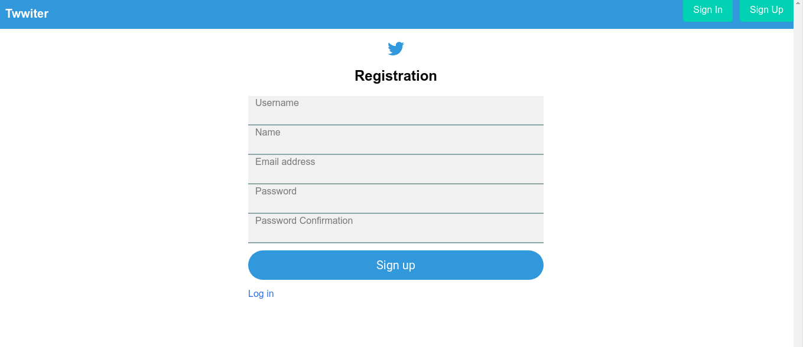

# Twitter Clone 🚀 

> This is a clone of the Twitter web site. 

## Getting Started
- Go to (https://github.com/Alexoid1/Twitter_clone) and have a look around.
- Open your Terminal.
- Clone repo
- write (bundle install)
- Go to the project's root
- Start server (rails server).

## Built With

- Ruby on Rails

### Prerequisites

- Browser
- Internet
- Download the code from repository (https://github.com/Alexoid1/Twitter_clone)
- Install ruby in rails
- Install yarn

## Credit

- Odin project (https://www.theodinproject.com/courses/ruby-on-rails/lessons/authentication?ref=lnav);
- Web Crunch (https://www.youtube.com/channel/UCzePijHDYnVHIXW6HYTL4dg)

## Authors

👤 **Pablo Alexis Zambrano Coral**

- Github: [@Alexoid1](https://github.com/Alexoid1)
- Twitter: [@pablo_acz](https://twitter.com/pablo_acz)
- Linkedin: [linkedin](https://www.linkedin.com/in/pablo-alexis-zambrano-coral-7a614a189/)

## 🤝 Contributing

Contributions, issues and feature requests and any type of feedback to improve are welcome!

## Show your support

Give a ⭐️ if you like this project!

## 📝 License

This project has no license.

